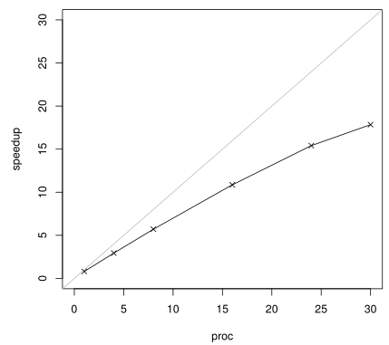
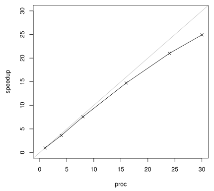
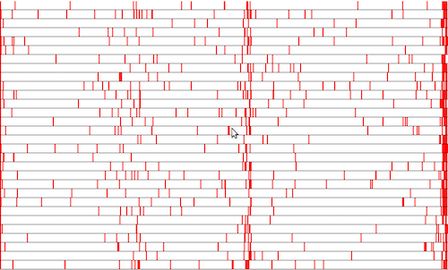
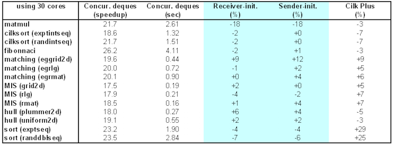
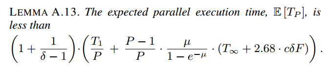

% pasl
% The parallel-algorithm scheduling library
% [Deepsea project](http://deepsea.inria.fr/)

Overview
========

While multicore computers have become mainstream, multicore
programming remains full of pitfalls. Using P cores to speed up one's
program by a factor close to P turns out to be far more challenging
than it might sound at first. Beyond the immediate difficultly of
parallelizing existing algorithms, one faces the problem of amortizing
the costs of thread creation, the challenge of dealing with dynamic
load balancing, the hazards of concurrent programming, and the
headaches associated with weak memory models.

Since January 2011, we have been working on the development of new
abstractions and scheduling algorithms for multicore programming. We
belive that, by using the right programming language abstractions
together with a flexible scheduler, multicore programming can become
much more accessible. To experiment our ideas, we have been developing
a C++ library, called pasl.

Related publications
====================

## Oracle Scheduling: Controlling Granularity in Implicitly Parallel Languages

[@acar-chargueraud-rainey-11-oracle]

[paper](oracle_scheduling.pdf)
[slides](2011_10_26_talk_oopsla_oracle.pdf)

## Efficient Primitives for Creating and Scheduling Parallel Computations

[@acar-chargueraud-rainey-12-primitives]

[paper](damp2012_primitives.pdf)
[slides](2012_01_28_talk_damp_par.pdf)

## Scheduling Parallel Programs by Work Stealing with Private Deques

[@acar-chargueraud-rainey-13-sched]

[paper](ppopp13.pdf)
[slides](ppopp2013-slides.pdf)

## Theory and Practice of Chunked Sequences

[@acar-al-14-sequences]

[paper](chunkedseq.pdf)
[slides](2014_09_08_talk_esa_chunked.pdf)

Software
========

The pasl sources are available via
[github](https://github.com/deepsea-inria/pasl).

Screenshots
===========

Speedup curves
--------------

Speedup curve for matrix-multiply (matrices of size 3500x3500).

Speedup curve for string search (pattern of 10 chars, text of 10
billion chars).

Processor utilization
---------------------

The plot shows utilization along the y axis and time along the x axis
in the computation of matrix-multiply.

Red rectangles correspond to idle time.

Experimental results
--------------------

Our experimental results show that work stealing algorithms based on
private deques are competitive with traditional concurrent work
stealing deques.

Parallel runs averaged on 20 runs (usually 5% to 10% difference
between a fast and a slow run); see our PPoPP'13 paper for details.

Theoretical result
------------------

We have proved the efficiency of a work stealing scheduler based on
private deques.

See our PPoPP'13  paper for details.

Team
====

- [Umut Acar](http://www.umut-acar.org/site/umutacar/)
- [Arthur Charguéraud](http://www.chargueraud.org/)
- [Mike Rainey](http://gallium.inria.fr/~rainey/)

Collaborators
=============

- Vitaly Aksenov
- Anna Malova

References
==========

Get the [bibtex file](pasl.bib) used to generate these
references.
