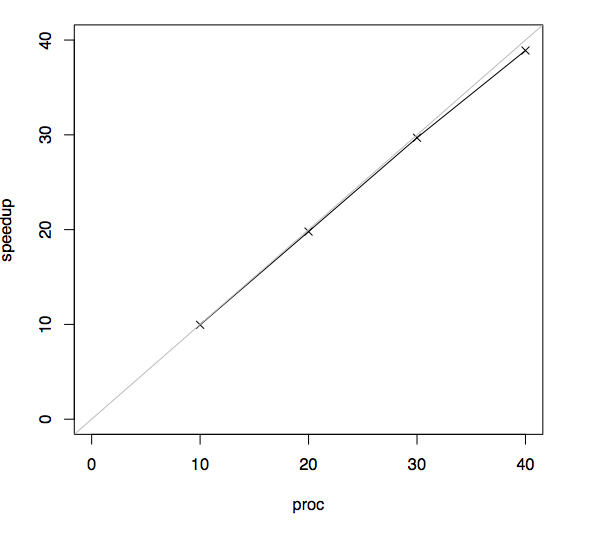
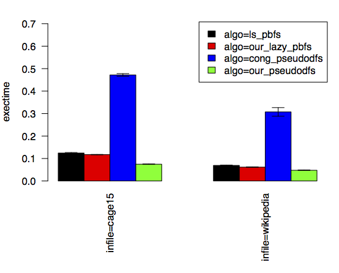
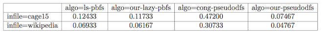

% pbench
% The parallel-program benchmarking kit
% [Deepsea project](http://deepsea.inria.fr/)

Overview
========

Benchmarking parallel programs is fraught with pitfalls. One often
finds that understanding the performance of their program requires
running multiple experiments with varying configurations and
subsequently analyzing the data. One must deal with factors such as
randomness in measurements, program faults, data collection and
analysis. To cope with the complexity, one often writes a brand new,
custom set of scripts, often in a scripting language such as python,
perl or bash. It is all too easy for mistakes to creep into these
scripts and for the errors to go undetected and lead to confusion or
false conclusions. While this problem is inherent to any significant
experimental study involving complex scripts, we believe that much can
be done to reduce this problem in the particular case of studies which
concern parallel codes on shared-memory machines.

In 2013, we began to develop a set of scripts, named pbench and
written in the [Caml](https://ocaml.org/) programming language, that
we could use to benchmark our parallel programs. Since then, we have
generalized our scripts and have studied in detail a number of
techniques to automate and ease the execution of experimental studies
on parallel codes.

We have a few reasons to believe that others may find pbench
useful. First, the scripts enjoy the correctness guarantees, such as
type safety, that are enforced by Caml. Second, we have carefully
designed a set of conventions and data structures for storing and
processing experimental data. Third, we have designed the scripts to
gracefully deal with program faults and timeouts. Fourth, we have
implemented generators for several types of output formats, such as
speedup plots, scatter and bar plots, and tables. We believe that,
provided additional effort from others, these scripts can become a
powerful tool to increase the rigor with which we analyze the
performance of our parallel codes.

The software produced from these efforts consists of a pair of
command-line tools, namely `prun` and `pplot`, and a library for
writing custom experimental evaluations. The aim of the `prun` and
`pplot` is to enable rapid experimentation with parallel codes in the
early stages of an experimental study. In addition, we implemented a
library to play the complementary role: that is, to provide a set of
core functions that we could use to write Caml scripts to automate
complex experimental evaluations of parallel codes. Our goal for these
scripts is to make it as pain free as we could for us and others to
repeat experiments that we report in our research papers.

In [a related research effort](#wi), we have studied a lightweight
performance-analysis technique for understanding the speedups obtained
by given parallel codes [@work-inflation]. Although this study is
still being prepared for publication, we post the draft here so that
others may learn about our technique and provide us with feedback.

Source code and documentation
=============================

Our source code is hosted on a [Github
repository](https://github.com/deepsea-inria/pbench).

The manual page for the `prun` tool is available in
[PDF](prun.pdf) and [HTML](prun.html), for the `pplot` tool
also in [PDF](pplot.pdf) and [HTML](pplot.html).

Demos
=====

We are going to present three small case studies and end with a link
to a substantial case where we used pbench for the empirical
evaluation in one of our research publications.

Conducting a speedup experiment
-------------------------------

To get started, let us consider an experiment that is typical for
parallel programming: one where the objective is to generate a speedup
plot. For purposes of our demo, the speedup of a parallel program that
is run on $P$ processors in time $T_p$ is defined by the ratio $T_S /
T_p$, where $T_S$ denotes the running time of a corresponding
sequential program. Our experiment is going to study a program which
computes the forty-seventh Fibonacci number, using a naive exponential
algorithm. This Fibonacci algorithm is the "hello world" algorithm of
parallel programming.

In this experiment, for simplicity, we are going to use the same
Fibonacci algorithm as both the sequential baseline and the parallel
program. In general, however, the pbench speedup plot allows the
sequential baseline program to be different from the parallel
program. Now, suppose, for example that running time of the sequential
baseline, which in our case is going to be the running time of the
Fibonacci algorithm on a single processor, is $T_S = 2s$. Further,
suppose that the running time of the parallel program on 2 processors
is $T_2 = 1s$. Then, the speedup is $T_S / T_2 = 2x$.

In this experiment, we have a binary, named `fib`, that takes as
argument a number, `-n 47`, and a number of processors, `-proc p`,
where we vary `p`. To run our experiment using ten processors, for
example, we woud issue the following command and get something like
the corresponding output.

~~~~~~~~~~~~~~~~~~~~~~~~~~~~~~~~~~~~~~
$ fib -n 47 -proc 10
exectime 2.696
~~~~~~~~~~~~~~~~~~~~~~~~~~~~~~~~~~~~~~

The output is printed by our Fibonacci program and, in this case, the
output represents the running time in seconds that was taken to
compute the forty-seventh Fibonacci number.  In other words, this
measurement was both taken internally and printed to `stdout` by our
Fibonacci program.

Setting up the experiment with `prun` is not much more work. Our next
step is to and collect data from one run of the baseline and four
parallel runs, using ten, twenty, thirty, and forty processors. In
order to get the corresponding command command lines from `prun`, we
need the following formatting.
 
~~~~~~~~~~~~~~~~~~~~~~~~~~~~~~~~~~~~~~
$ prun speedup -baseline "fib -proc 1" -parallel "fib -proc 10,20,30,
40" -n 47
~~~~~~~~~~~~~~~~~~~~~~~~~~~~~~~~~~~~~~

The `prun speedup` part of the above command tells `prun` to perform a
speedup experiment. Each speedup experiment requires three additional
parts: the baseline-specific command, the parallel-specific command
and the shared commands. In this case, our baseline command is `fib
-proc 1`. This command is issued to `prun` by putting the command into
the quotes after the argument `-baseline`. The parallel-specific
command is specified in a similar fashion. All commands that are
shared between the baseline and parallel runs must be specified once,
after the `-baseline` and `-parallel` commands. In our example, the
only shared command is the input size, which is specified by `-n 47`.

Note that `fib`, `-proc 1`, `-proc 10,20,30,400`, and `-n 47` are
specific to our `fib` program, whereas `-baseline` and `-parallel` are
builtin keywords of the `prun` tool.

The command lines that are issued and the running times that are
collected by `prun` are echoed to `stdout`. The data that is collected
by `prun` is written by `prun` to the file `results.txt`.

~~~~~~~~~~~~~~~~~~~~~~~~~~~~~~~~~~~~~~
[1/5]
fib -n 47 -proc 1
exectime 26.840
[2/5]
fib -n 47 -proc 10
exectime 2.696
[3/5]
fib -n 47 -proc 20
exectime 1.356
[4/5]
fib -n 47 -proc 30
exectime 0.904
[5/5]
fib -n 47 -proc 40
exectime 0.690
Benchmark successful.
Results written to results.txt.
~~~~~~~~~~~~~~~~~~~~~~~~~~~~~~~~~~~~~~

Now, to generate the speedup curve, all we have to run is the `pplot`
comand.

~~~~~~~~~~~~~~~~~~~~~~~~~~~~~~~~~~~~~~
$ pplot speedup
~~~~~~~~~~~~~~~~~~~~~~~~~~~~~~~~~~~~~~

If successful, the output is the following.

~~~~~~~~~~~~~~~~~~~~~~~~~~~~~~~~~~~~~~
Starting to generate 1 charts.
Produced file plots.pdf.
~~~~~~~~~~~~~~~~~~~~~~~~~~~~~~~~~~~~~~

The plot that we see should look like this one.

Our `pplot` depends on the [R](http://www.r-project.org/) tool and
LaTeX for generating plots. When `pplot` generates new plots, all
intermediate R and latex sources that were generated by `pplot` are
written to the `_results` folder. It is not hard to customize the look
of the plots by editing these files individually.

Comparing multiple algorithms with a bar plot
---------------------------------------------

Now, let us consider how we might compare the running times of four
different parallel graph-search algorithms using two different sample
graphs. The following command line shows how we run one of these
algorithms, namely `ls_pbfs`, using a few command-line arguments, such
as `-frontier ls_bag` that are specific to this algorithm.

~~~~~~~~~~~~~~~~~~~~~~~~~~~~~~~~~~~~~~
$ search -load from_file -infile cage15 -proc 40 -algo 
ls_pbfs -frontier ls_bag -ls_pbfs_cutoff 512 -ls_pbfs_loop_cutoff 512
~~~~~~~~~~~~~~~~~~~~~~~~~~~~~~~~~~~~~~

To get started, we are going to use `prun` to run the same command
above and collect the data. Moreover, by specifying `-runs 3`, we are
going to take three samples for this algorithm.

~~~~~~~~~~~~~~~~~~~~~~~~~~~~~~~~~~~~~~
$ prun -runs 3 search -load from_file -infile cage15,wikipedia -proc 40 -algo 
ls_pbfs -frontier ls_bag -ls_pbfs_cutoff 512 -ls_pbfs_loop_cutoff 512
~~~~~~~~~~~~~~~~~~~~~~~~~~~~~~~~~~~~~~

After the run of the first three runs complete, we should have the
data stored in `results.txt`. Now, let us perform the runs for the
next algorithm, namely `our_lazy_pbfs`. Our use of `prun` is going to
be the same, except for one additional argument: `--append`. This
setting tells `prun` to append the newly collected data to the
existing `results.txt` file.

~~~~~~~~~~~~~~~~~~~~~~~~~~~~~~~~~~~~~~
$ prun -runs 3 --append search -load from_file -infile cage15,wikipedia -proc 40 
-algo our_lazy_pbfs -our_lazy_pbfs_cutoff 128 
~~~~~~~~~~~~~~~~~~~~~~~~~~~~~~~~~~~~~~

We do the same for the algorithm `cong_pseudodfs`.

~~~~~~~~~~~~~~~~~~~~~~~~~~~~~~~~~~~~~~
$ prun -runs 3 --append search -load from_file -infile cage15,wikipedia -proc 40 
-algo cong_pseudodfs
~~~~~~~~~~~~~~~~~~~~~~~~~~~~~~~~~~~~~~

And we do the same for `our_pseudodfs`.

~~~~~~~~~~~~~~~~~~~~~~~~~~~~~~~~~~~~~~
$ prun -runs 3 --append search -load from_file -infile cage15,wikipedia -proc 40
-algo our_pseudodfs -our_pseudodfs_cutoff 1024
~~~~~~~~~~~~~~~~~~~~~~~~~~~~~~~~~~~~~~

Finally, we can create a barplot from this data, we can simply issue
the following command.

~~~~~~~~~~~~~~~~~~~~~~~~~~~~~~~~~~~~~~
$ pplot bar -x infile -y exectime -series algo --xtitles-vertical
~~~~~~~~~~~~~~~~~~~~~~~~~~~~~~~~~~~~~~

The plot that we get shows us bars grouped together by the input
graph. On the y axis is the average of the three running times that we
collected for each bar. We can see which algorithms are faster and,
thanks to the error bars, how much noise there is in our measurements.

Comparing multiple algorithms with a table
------------------------------------------

Using the same data as above, we can easily generate a table reporting
on the running times. 

~~~~~~~~~~~~~~~~~~~~~~~~~~~~~~~~~~~~~~
$ pplot table -row infile -col algo -cell exectime
~~~~~~~~~~~~~~~~~~~~~~~~~~~~~~~~~~~~~~

The table that is generated is a latex table, and when rendered, looks
like this one.

Chunked-sequence experimental study
-----------------------------------

We used pbench to encode the experimental evaluation that was reported
in our publication on a data structure called the chunked
sequence. The sources for this evaluation are available from the
[chunked-sequence project page](http://deepsea.inria.fr/chunkedseq/).

Related research articles
=========================

## Parallel Work Inflation, Memory Effects, and their Empirical Analysis {#wi}

[@work-inflation]

[paper](work-inflation.pdf)

Team
====

- [Umut Acar](http://www.umut-acar.org/site/umutacar/)
- [Arthur Charguéraud](http://www.chargueraud.org/)
- [Mike Rainey](http://gallium.inria.fr/~rainey/)

References
==========

Get the [bibtex file](pbench.bib) used to generate these
references.
